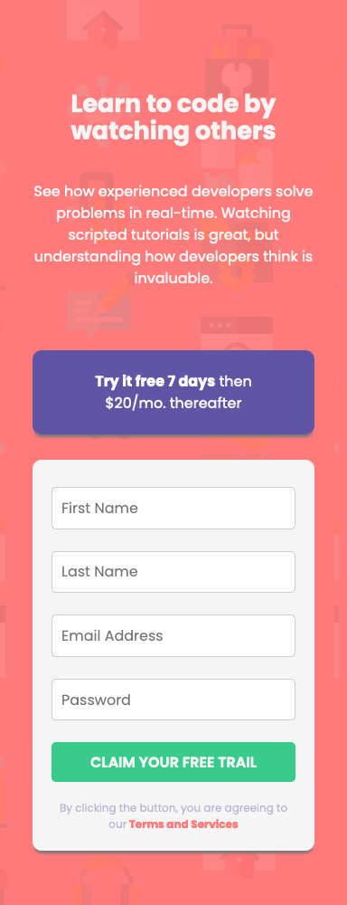
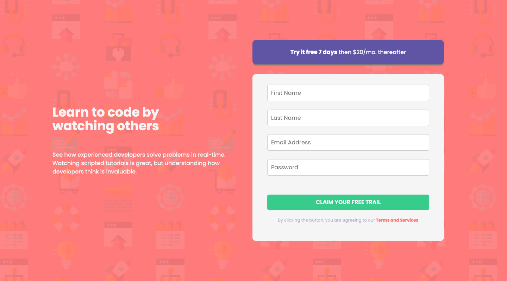

# Frontend Mentor - Intro component with sign up form solution

This is a solution to the [Intro component with sign up form challenge on Frontend Mentor](https://www.frontendmentor.io/challenges/intro-component-with-signup-form-5cf91bd49edda32581d28fd1). Frontend Mentor challenges help you improve your coding skills by building realistic projects.

## Table of contents

- [Overview](#overview)
  - [The challenge](#the-challenge)
  - [Screenshot](#screenshot)
  - [Links](#links)
- [My process](#my-process)
  - [Built with](#built-with)
  - [What I learned](#what-i-learned)
  - [Continued development](#continued-development)
  - [Useful resources](#useful-resources)
- [Author](#author)

## Overview

### The challenge

Users should be able to:

- View the optimal layout for the site depending on their device's screen size
- See hover states for all interactive elements on the page
- Receive an error message when the `form` is submitted if:
  - Any `input` field is empty. The message for this error should say _"[Field Name] cannot be empty"_
  - The email address is not formatted correctly (i.e. a correct email address should have this structure: `name@host.tld`). The message for this error should say _"Looks like this is not an email"_

### Screenshot

### Links

- Solution URL: [Add solution URL here](https://www.frontendmentor.io/solutions/introd-component-with-signup-form-359Jt2ZFFd)
- Live Site URL: [Vercel](https://intro-component-with-signup-form-six-xi.vercel.app/)

## My process

### Built with

- Semantic HTML5 markup
- CSS custom properties
- Flexbox
- Mobile-first workflow
- JavaScript

### What I learned

- JavaScript regular expression
- Getting input values from input field such as text, password and email

### Continued development

- Responsive design with CSS
- JavaScript regular expression
- CSS box model

### Useful resources

- [Head First JavaScript Programming Book](https://www.amazon.com/Head-First-JavaScript-Programming-Brain-Friendly-ebook/dp/B00J9TMSDU) - I really liked how pictures are used to demonstrate and explain topics and exercise at the end of each topic.
- [Codecademy Learn JavaScript Course - Free](https://www.codecademy.com/learn/introduction-to-javascript) - This is an amazing course which helped me finally understand the basics of JavaScript. I'd recommend it to anyone still learning this concept.

## Author

- Frontend Mentor - [@mayor-creator](https://www.frontendmentor.io/profile/mayor-creator)
